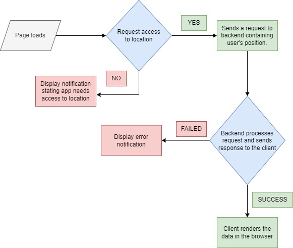

# Weather App
[wethapp.cyclic.app](https://wethapp.cyclic.app)
## Description
This project is basically a web app that displays the weather conditions of the user's location. Users can also search for the weather condition of a different location by name. All of these is made possible via integration of the OpenWeatherMap API. Also, the user's location is access via the GeoLocation API (accessible on the browser).

The workflow looks like this

The search workflow as looks closely like that.

## How to run this project
This project can be viewed [here](https://wethapp.cyclic.app) but if you want to run it locally, you can do so by following these steps.
- Clone the repo.
- Run ``yarn install`` or ``npm install`` (You may have to delete the yarn.lock file to avoid conflicts if you opt in for npm)
- Create an account with OpenWeatherMap API and generate an access key
- Set an environment variable with variable name of ``OPEN_WEATHER_API_KEY``, assign your access key to this variable. Also create another variable ``PORT`` to specify the port on which the localhost will run. On a local environment, this can be setup easily with ``dotenv``.
- Run ``yarn run dev`` (or ``npm run dev``) to start the development server.
### Extras
The ``start`` script in the package.json file is meant for use in production but you can still use it locally. Before using it, you should run the ``build`` script first, this transpiles the typescript files to javascript. Without this, the ``start`` script will fail, as it is setup to start the server from the transpiled javascript files.

*Also, make the `start` script in the `package.json` file run this command instead ``cross-env NODE_ENV=prod node dist/server.js``*. This sets an environment variable `NODE_ENV` to `prod` before starting the server. As the production code needs this environment variable to be set accordingly for it to function properly.

Run ``yarn run gdoc`` to generate the doc using JSDoc.

You can also run tests by running ``yarn run test`` (or ``npm run test``)
## Credits
OpenWeatherMap API